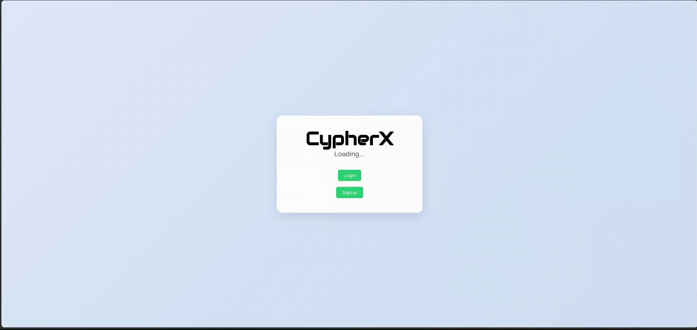

# SecureConnect - Authentication System

Welcome to **SecureConnect**, a secure and user-friendly authentication system built for the **Xcelerate** hackathon. This project includes a **signup** and **login** system with proper validation, error handling, and session management.

---

## Demo


[Full Video Link](https://drive.google.com/file/d/1NNh3ah3pfPlNdLlSh-owM3lZOrFaOVk_/view?usp=sharing)

---

## Table of Contents
1. [Features](#features)
2. [Tech Stack](#tech-stack)
3. [Setup Instructions](#setup-instructions)
4. [Database Configuration](#database-configuration)
5. [API Endpoints](#api-endpoints)
6. [Additional Features](#additional-features)
7. [Team](#team)
8. [Contact](#contact)

---

## Features
### Signup Page
- Input fields: Username, Password, Confirm Password.
- Real-time validation:
  - Username must be unique and at least 8 characters long.
  - Password must contain:
    - At least one uppercase letter.
    - At least one lowercase letter.
    - At least one special character.
  - Confirm Password must match Password.
- Error messages displayed under each field if validation fails.
- Successful signup redirects to the login page after 2 seconds.

### Login Page
- Input fields: Username, Password.
- Validation:
  - Prevent login if fields are empty.
  - Check if the username exists and the password is correct.
- Successful login redirects to a landing page with a personalized message: `Hello, <username>!`.

### Session Management
- Users remain logged in until they click the "Logout" button.
- Logout redirects users to the login page.

---

## Tech Stack
- **Frontend**: Next.js, React
- **Backend**: Next.js API Routes.
- **Database**: MySQL with prisma.

---

## Setup Instructions
1. Clone the repository:
   ```bash
   git clone https://github.com/KSDeshappriya/SpiritX_CypherX_01.git
   ```
2. Install dependencies:
   ```bash
   npm install
   ```
3. Set up the database (see [Database Configuration](#database-configuration)).
4. Start the development server:
   ```bash
   npm run dev
   ```
5. Open your browser and navigate to `http://localhost:3000`.

---
## Database Configuration
1. Create a MySQL database:
  ```sql
  CREATE DATABASE secure_connect;
  ```

2. Update the `.env` file with your database connection string:
  ```properties
  DATABASE_URL="mysql://root:@localhost:/secure-connect"
  ```

3. Run the Prisma migrations to set up the database schema:
  ```bash
  npx prisma migrate dev --name init
  ```

4. Generate the Prisma client:
  ```bash
  npx prisma generate
  ```

5. Verify the database connection and schema:
  ```bash
  npx prisma db pull
  ```

Your database should now be configured and ready to use.

---

## API Endpoints
### POST /api/auth/signup
- **Description**: Registers a new user.
- **Request Body**:
  ```json
  {
    "username": "string",
    "password": "string",
    "confirmPassword": "string"
  }
  ```
- **Responses**:
  - `201 Created`: User registered successfully.
  - `400 Bad Request`: Invalid input or username already exists.
  - `405 Method Not Allowed`: Request method is not POST.

### POST /api/auth/login
- **Description**: Authenticates a user and returns a JWT token.
- **Request Body**:
  ```json
  {
    "username": "string",
    "password": "string"
  }
  ```
- **Responses**:
  - `200 OK`: Login successful, returns a JWT token.
  - `401 Unauthorized`: Invalid username or password.
  - `405 Method Not Allowed`: Request method is not POST.

---

## Additional Features
### Dashboard
- Personalized greeting with the username.
- Quick stats section displaying sessions, projects, and tasks.
- Logout button to end the session and redirect to the login page.

### Error Handling
- Comprehensive error messages for invalid inputs during signup and login.
- Proper HTTP status codes for API responses.

### Security
- Password hashing using bcrypt.
- JWT-based authentication for secure session management.

### Responsive Design
- Mobile-friendly layout with Bootstrap integration.
- Consistent and modern UI/UX across different devices.

### Code Quality
- Modular and reusable code components.
- Well-documented codebase for easy maintenance and scalability.
- Use of TypeScript for type safety and better developer experience.
- Integration with Prisma for database management.

### Deployment
- Ready for deployment on Vercel or any other hosting platform supporting Next.js.
- Environment variable management for secure configuration.
- Continuous integration and deployment setup.


---

## Team
- **Team Name**: CypherX
- **Members**:
  - [](https://github.com/KSDeshappriya)
    [**Kavindu Deshappriya**](https://github.com/KSDeshappriya)
  - [](https://github.com/WMAPraveen)
    [**Avishka Wijesinghe**](https://github.com/WMAPraveen)
  - [](https://github.com/ishanirathnayaka)
    [**ishanirathnayaka**](https://github.com/ishanirathnayaka)
  - [](https://github.com/ChaminiMaduwanthi)
    [**Chamini Maduwanthi**](https://github.com/ChaminiMaduwanthi)


---

## Contact
For any inquiries, please contact us at [ksdeshappriya.official@gmail.com](mailto:ksdeshappriya.official@gmail.com).

---

Good luck, and happy coding! 🚀